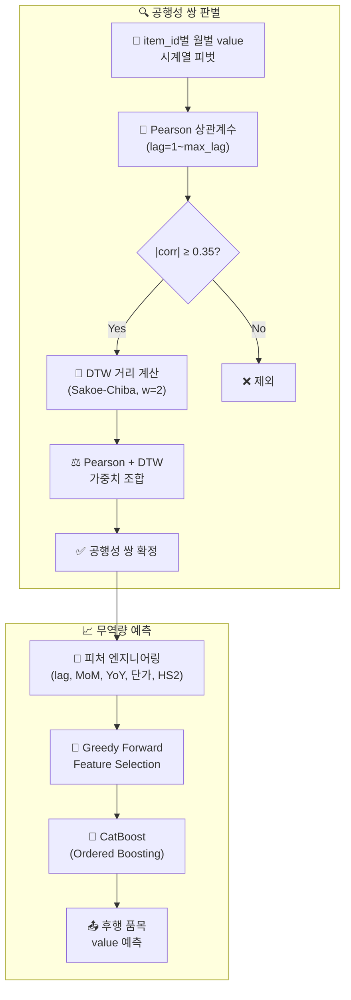

<div align="center">

# 📈 제3회 국민대학교 AI빅데이터 분석 경진대회

**무역 품목 간 공행성(Comovement) 쌍 판별 및 후행 품목 무역량 예측**

[](https://www.python.org/)
[](https://catboost.ai/)
[](https://optuna.org/)
[](https://scikit-learn.org/)
[](https://pandas.pydata.org/)
[](https://numpy.org/)

`DACON` · `국민대학교 경영대학원 × KOAMI` · `2025.11` · `1,701팀 참가` · **SMAPE: 0.4058**

</div>

---

## 📌 Key Highlights

| | |
|:---|:---|
| 🏆 **결과** | 최종 SMAPE **0.4058** (1,701팀 참가) |
| 🎯 **핵심 과제** | 100개 수입 품목에서 공행성(Comovement) 쌍을 **자체 설계한 방법론**으로 판별 |
| ⚡ **접근 방식** | Pearson 상관계수 + DTW(Dynamic Time Warping) 기반 3중 필터 파이프라인 |
| 📊 **모델** | CatBoost (Ordered Boosting으로 시계열 target leakage 방지) |
| 🔧 **피처 선택** | Greedy Forward Selection으로 과적합 억제 |

---

## 🔍 과제 정의

무역 데이터에서 품목 간 구조적 관계를 탐색하고, 예측 기반 의사결정 지원 도구로 활용 가능한 AI 모델을 개발하는 대회입니다.

**두 가지 과제:**

1. **공행성(Comovement) 쌍 판별** — 100개 품목(item_id)의 과거 거래 데이터에서, 시간적으로 유사하게 움직이는 공행성 쌍(선행 → 후행)을 식별
2. **후행 품목 무역량 예측** — 선행 품목의 흐름을 기반으로, 후행 품목의 다음 달 총 무역량(value)을 예측

> 대회는 공행성 쌍 판별 방법론을 규정하지 않음 — **판별 방법 자체를 설계하는 것이 핵심 난이도**

**평가 지표 — SMAPE:**

$$\text{SMAPE} = \frac{100\%}{n} \sum_{t=1}^{n} \frac{|F_t - A_t|}{(|A_t| + |F_t|)/2}$$

---

## 🏗️ Architecture



---

## ⚙️ 핵심 방법론

### 1. 공행성 쌍 탐지 — Pearson + DTW 3중 필터

| 단계 | 방법 | 역할 |
|:---:|:---|:---|
| 1차 | Pearson 상관계수 (lag별) | 선형 유사도 기반 후보 선별 |
| 2차 | DTW (Sakoe-Chiba, window=2) | 비선형 패턴 유사도 검증 |
| 3차 | 가중치 조합 | 최종 쌍 확정 (임계값 ≥ 0.35) |

**Pearson만으로는 부족한 이유:** 선형 유사도만 포착하므로, 시간축이 어긋나거나 비선형적으로 움직이는 관계를 놓칩니다. DTW가 이를 보완합니다.

### 2. 피처 엔지니어링 + Greedy Forward Selection

| 피처 유형 | 역할 |
|:---|:---|
| **공행성 lag 피처** | 선행 품목의 이전 시점 value → 핵심 cross-item 신호 |
| **MoM 성장률** | 전월 대비 변화율 → 단기 추세 |
| **YoY 성장률** | 전년 동월 대비 → 계절성 반영 |
| **단가 피처** | value / quantity → 단위 가격 변동 |
| **HS2 카테고리** | HS4 앞 2자리 → 산업군 그룹 효과 |

Greedy Forward Selection: 피처를 하나씩 추가하며 검증 SMAPE가 개선되는 경우에만 채택

### 3. 최종 모델 설정

| 설정 | 값 | 근거 |
|:---:|:---:|:---|
| 모델 | **CatBoost** | Ordered Boosting → 시계열 target leakage 방지 |
| 임계값 | **0.35** | 0.325 대비 노이즈 쌍 감소 |
| Dropout | **0.04** | 과적합 방지 |

---

## 📊 실험 흐름

| # | 실험명 | 핵심 변경 | SMAPE |
|:---:|:---|:---|:---:|
| 1 | BASELINE_p_corr | Pearson 기반 공행성 탐지 | — |
| 2 | BASELINE_p_corr_dtw | + DTW 비선형 유사도 | — |
| 3 | BASELINE_corr_filter | + 임계값 필터 최적화 | — |
| 4 | Basic_Best_Baseline | + Greedy Feature Selection | — |
| 5 | **BEST_weight_filtering** | **+ 가중치/임계값 최적화** | **0.4058** ✅ |

### 폐기된 실험

| 실험 | 폐기 근거 |
|:---|:---|
| Oversampling | 시계열 분포 왜곡 → SMAPE 악화 |
| AutoGluon | 단일 CatBoost 대비 추가 이점 없음 |
| max_lag 확대 | 노이즈 쌍 급증, 신호 대비 잡음 악화 |
| 값 스케일링 | Pearson은 스케일 불변이므로 무의미 |

---

## 🧠 핵심 기술 설계 로직

<details>
<summary><b>공행성 탐지 설계 — 그레인저 인과성에서 착안</b></summary>

> 경제학의 Granger Causality 개념에서 착안하여, A의 과거값이 B의 현재값 예측에 유효한 정보를 포함하는지를 시계열 상관 분석으로 검증합니다. 대회가 방법을 규정하지 않았기 때문에 이 설계 자체가 핵심 의사결정이었습니다.
</details>

<details>
<summary><b>DTW의 Sakoe-Chiba Band 제약</b></summary>

> DTW의 O(n²) 복잡도를 Sakoe-Chiba band(window=2) 적용으로 O(nw)로 감소. 최대 2개월의 시간축 왜곡만 허용하여 과도한 비선형 매칭을 방지합니다.
</details>

<details>
<summary><b>CatBoost Ordered Boosting</b></summary>

> 전통적 GBDT는 시계열에서 미래 정보 누출(target leakage) 위험이 있습니다. CatBoost의 Ordered Boosting은 학습 시점 이전 데이터만 사용하므로 이를 구조적으로 방지합니다.
</details>

<details>
<summary><b>Greedy Feature Selection의 과적합 억제</b></summary>

> 모든 피처 포함 시 차원의 저주(Curse of Dimensionality) 발생. 하나씩 추가하며 검증 SMAPE 개선 시에만 채택하는 탐욕적 탐색으로 효율적 균형점 확보.
</details>

---

## 📁 프로젝트 구조

```
제3회국민대공모전/
├── data/
│   └── train.csv                        # 학습 데이터
├── code/
│   ├── BASELINE_p_corr.ipynb            # Pearson 이스라인
│   ├── BASELINE_p_corr_dtw.ipynb         # + DTW
│   ├── Basic_Best_Baseline.ipynb         # + Greedy Feature Selection
│   ├── BEST_weight_filtering.ipynb       # ★ 최종 제출
│   ├── Model_Compare.ipynb              # CatBoost vs XGBoost
│   ├── Confusion_Matrix.ipynb            # 공행성 쌍 혼동 행렬
│   └── Not_Using/                        # 폐기된 실험 아카이브
├── repo/
│   └── README.md
└── notion_document.md
```

---

## 📎 References

| | |
|:---|:---|
| 🏆 | [DACON 대회 페이지](https://dacon.io/competitions/official/236619/overview/description) |
| 📚 | [CatBoost 공식 문서](https://catboost.ai/docs/) |
| 🔄 | [Dynamic Time Warping](https://en.wikipedia.org/wiki/Dynamic_time_warping) |
| ⚡ | [Optuna 하이퍼파라미터 최적화](https://optuna.org/) |
